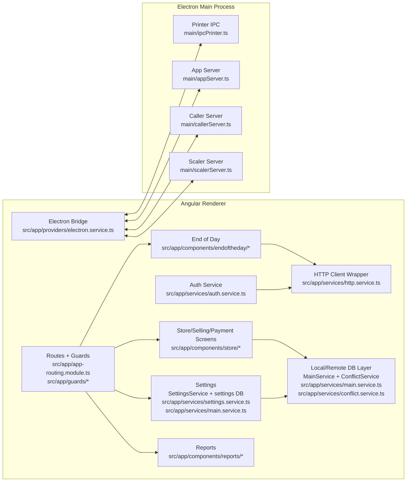

# C4: Components (High-Level)

Bu seviyede “component” kelimesi C4 anlamındadır (Angular component değil). Amaç: ana sorumlulukları ve sınırları hızlı göstermek.

## Notes / TODO (needs confirmation)

- Renderer ↔ main IPC kanalları, `src/app/providers/electron.service.ts` ve `main/*` içinde kullanılan `ipcMain.on(...)` event isimleri üzerinden dokümante edilmelidir.

