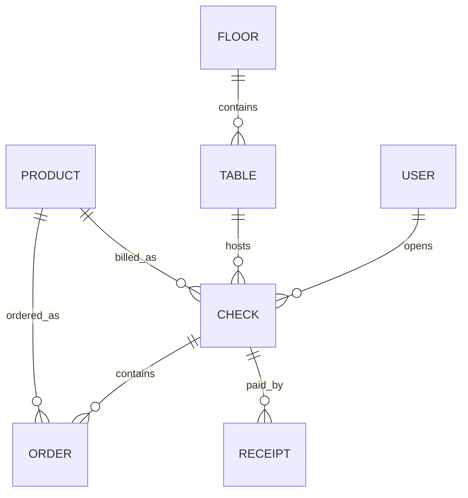

# Data Model (Conceptual)

Bu repo bir RDBMS şeması değil, PouchDB (document store) kullanır. Bu yüzden “ERD” burada konsept seviyesindedir ve alanlar büyük ölçüde belirsizdir.

## Local DB Catalog (from code)

`MainService` içinde görülen local PouchDB adları (`src/app/services/main.service.ts`):

- `local_users`, `local_users_group`
- `local_checks`, `local_closed_checks`
- `local_orders`, `local_receipts`
- `local_cashbox`, `local_reports`, `local_logs`
- `local_products`, `local_categories`, `local_sub_cats`, `local_recipes`, `local_comments`
- `local_customers`, `local_credits`
- `local_floors`, `local_tables`
- `local_stocks`, `local_stocks_cat`
- `local_calls`, `local_prints`, `local_commands`
- `local_settings`, `local_alldata`

## Conceptual ERD (Assumption / TODO)

TODO (needs confirmation):

- Entity alanları (fields) ve ilişki anahtarları (ör. `check_id`, `table_id`) mocks’lardan ve runtime doc’lardan doğrulanmalı (`src/app/mocks/*`).

